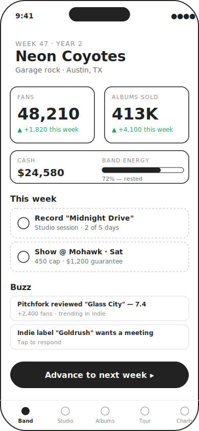
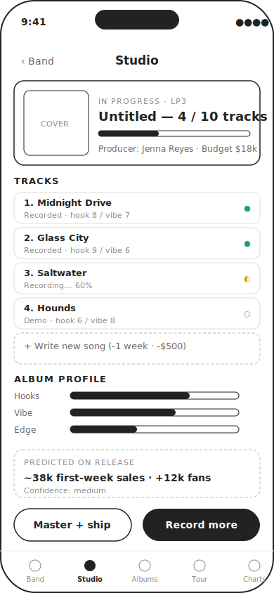
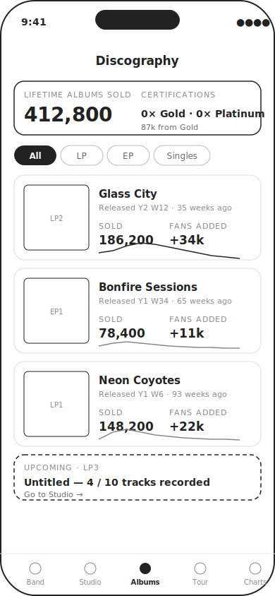
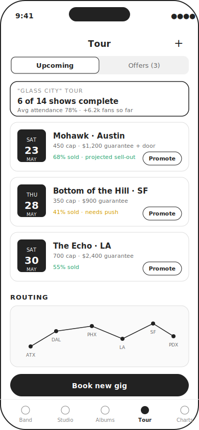
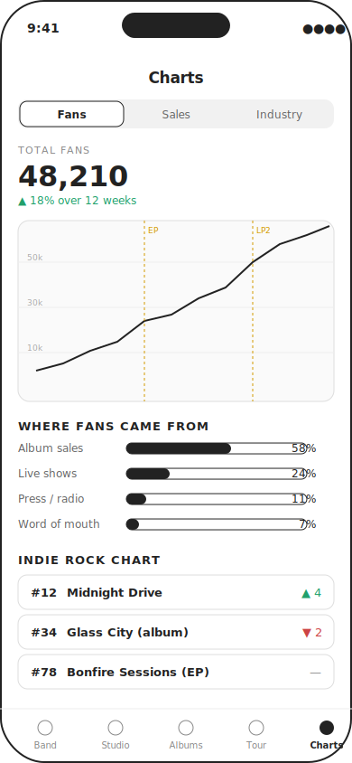

# Rock Band Sim — Product & Design Spec

*iOS career-sim game. Working title: TBD.*
*Draft v0.1 · May 2026*

---

## 1. Concept in one paragraph

You start as a four-piece bar band with 0 fans, $2,000, and a beat-up van. Each turn is one week. You write songs, record albums, book gigs, and make small career decisions — and the game answers back with two numbers that matter more than anything else: **albums sold** and **fan count**. Fans buy your next album. Albums earn new fans. The loop compounds — or stalls out, and you have to figure out why.

The fantasy is the part of being in a band you never get to experience in real life: watching your decisions move the needle, week over week, over a 10-year career.

## 2. Player & session shape

The target player likes Football Manager, Game Dev Tycoon, and Hollywood Animal — sims where numbers tell a story. They don't want twitch gameplay; they want to plan, watch results, and adjust.

A session is **5–15 minutes**. The player opens the app, reads the week's news, makes one or two decisions (book a gig, approve a mix, accept an interview), taps **Advance week**, and is shown what happened. The app is designed for short pickup sessions but rewards longer planning passes.

## 3. The two numbers

Everything in the game serves two stats:

**Fans** is the size of your audience — anyone who would consider buying your next release or coming to a show. Fans grow from album sales, live shows, press coverage, and word-of-mouth from existing fans. Fans decay slowly if the band goes quiet (no releases, no shows).

**Albums sold** is lifetime units across your discography. Each album sells on its own curve, peaking in the weeks after release and tapering off. Sales feed cash, certifications (Gold/Platinum), and chart position — but more importantly, sales feed *more fans*, which feed *more sales of the next album*. This is the compounding loop.

Both numbers are visible at all times on the Dashboard.

## 4. Core loop

```
            ┌─────────────────────────────┐
            │   Write & record album      │ ◀──┐
            └──────────────┬──────────────┘    │
                           ▼                   │
            ┌─────────────────────────────┐    │
            │   Release → sales curve     │    │
            └──────────────┬──────────────┘    │
                           ▼                   │
       ┌────────────────────────────────┐      │
       │  Fans grow (sales + tour + PR) │      │
       └───────────────┬────────────────┘      │
                       ▼                       │
       ┌────────────────────────────────┐      │
       │  Bigger venues, bigger budgets │ ─────┘
       └────────────────────────────────┘
```

A loop iteration is roughly 8–20 in-game weeks. A full career is ~10 in-game years (~520 weeks), with diminishing returns and a soft ending around year 8–10 when the band breaks up, sells out, or goes on a permanent farewell tour.

## 5. Systems

### 5.1 Time
- One turn = one week.
- The player can **batch-advance** (e.g. "skip ahead 4 weeks") if nothing is pending. This keeps the game from becoming a tap-counter during recording or touring.
- Some events pause auto-advance (offers, member crises) and require a decision.

### 5.2 Band
- Four members at start: vocals, guitar, bass, drums. Each has skill stats (musicianship, songwriting, stage presence), an energy meter (0–100), and a morale meter (0–100). A member with low morale will quit; low energy hurts every action's outcome.
- Members can be added (keys, second guitar), swapped, or fired. Lineup changes cost morale across the rest of the band.
- The band has a **genre** (garage rock, indie, prog, etc.) that influences which audiences and venues are receptive. Genre can drift over time as a strategic choice.

### 5.3 Songwriting & recording
- Songs are written in 1–3 weeks. Each song has hidden quality dimensions: **hook**, **vibe**, **edge** (0–10 each), determined by member skills + a random roll.
- Songs sit in a backlog until you pick them for an album. An album is 8–12 tracks.
- Recording an album costs time (4–12 weeks), cash (depends on producer), and a small morale hit. Better producers raise the floor on hook/vibe/edge.

### 5.4 Albums & sales
- Each album has a **quality score** = weighted average of its tracks' dimensions, plus a producer bonus.
- On release, the game rolls a launch event — Pitchfork score, radio adds, TikTok moment — that modifies the launch multiplier.
- First-week sales formula (see §6.1) takes fans, quality, and launch multiplier as inputs. After week one, sales follow a decay curve (–15% week-over-week, slower if charting).
- Each sold copy earns the band roughly **$0.80–$3.00** depending on label deal (self-release pays more per unit but has lower reach).
- Certifications: Gold at 500k, Platinum at 1M, Diamond at 10M. Each unlocks unique news beats.

### 5.5 Fans
- Fan count grows weekly from three sources:
  - **Album sales** (≈ 1 new fan per 6 units sold, decaying)
  - **Live shows** (each attendee has a chance of converting; depends on stage presence and album quality)
  - **Press / radio / virality** (event-driven, sometimes huge)
- A small **word-of-mouth** trickle is proportional to existing fans (compounds the loop).
- Fans decay 0.5%/week if no release in the last 26 weeks and no shows in the last 12.

### 5.6 Money
- Income: album royalties, gig guarantees + door splits, merch (1–3 items per gig), publishing later in career.
- Expenses: rent/van/practice space (~$400/week), recording, marketing, gear upgrades, hired help.
- Negative cash for more than 4 weeks ends the game ("the band breaks up over money").

### 5.7 Tour & gigs
- Venues have a capacity tier (200 / 500 / 1,500 / 3,000 / 10,000+). Each venue has a minimum-fans threshold to be offered.
- The player books individual gigs or accepts tour offers (a packaged set of dates). Routing affects energy cost — back-to-back cities are cheaper than zig-zags.
- Show results: attendance % (driven by fans in market × promotion × day-of-week), money earned, new fans, energy/morale impact.
- Disasters: gear failure, member sick, fight with promoter — small chance, mitigated by hiring a tour manager.

### 5.8 Events & decisions
- Random weekly events: label offers, sync licensing requests, interview offers, a member's side project, a rival band's diss, a fan blog write-up.
- Each event is a 2–4 choice card. Choices have transparent immediate effects (cash, fans) and opaque long-term effects (relationships, reputation tags).

### 5.9 Hidden state
- Each scene/genre has an opinion of the band (loved, respected, ignored, hated). This drives which press covers you and which venues offer slots.
- Reputation tags: "sellouts," "DIY heroes," "live legends," "studio band," etc. Tags accumulate and gate certain events.

## 6. Sample math

### 6.1 First-week album sales

```
firstWeekUnits = fans × conversionRate(quality) × launchMultiplier × seasonality

conversionRate(quality):
  quality 0–3   → 0.05
  quality 4–6   → 0.15
  quality 7–8   → 0.30
  quality 9–10  → 0.45

launchMultiplier ∈ [0.6, 2.0]   (rolled at release)
seasonality ∈ [0.85, 1.15]      (Q4 highest)
```

Worked example: 48,000 fans · quality 7 (0.30) · launch 1.1 · seasonality 1.0 = **15,840 first-week units**. Tunable.

### 6.2 Weekly fan gain

```
weeklyFans = (unitsSoldThisWeek / 6)
           + Σ (showAttendees × showConversion)
           + pressEventBonus
           + (currentFans × 0.002)        // word of mouth
           − (currentFans × decayFactor)  // if dormant
```

### 6.3 Show attendance

```
attendance% = min(1.0,
   (fansInMarket / venueCapacity) × promotion × dayMultiplier × bandHotness
)
fansInMarket = totalFans × marketShare(city) × genreFit(scene)
```

Numbers above are starting points for playtesting, not final balance.

## 7. Screen map

The app is a 5-tab structure. Tapping **Advance week** is always available from the Dashboard.

| # | Tab     | Purpose                                                |
|---|---------|--------------------------------------------------------|
| 1 | Band    | Dashboard, member roster, weekly summary, decisions    |
| 2 | Studio  | Songwriting backlog, in-progress album, release tools  |
| 3 | Albums  | Discography, sales curves, certifications              |
| 4 | Tour    | Upcoming gigs, offers, routing map, book new gig       |
| 5 | Charts  | Fan growth chart, sales chart, industry chart position |

Secondary screens (modal): Member detail, Song editor, Producer picker, Gig booking flow, Event card, Settings.

## 8. Wireframes

Low-fidelity sketches for the five primary screens. iPhone 14 viewport (390×844).

### 8.1 Dashboard



The most-visited screen. The two KPIs sit at eye level. Below them, "This week" surfaces the 1–3 things the player needs to attend to. Buzz is a news feed. The big **Advance week** button is always one thumb away.

### 8.2 Studio



Where the in-progress album lives. Each track shows recording state and quality dimensions. The "Album profile" bars show how the record is shaping up; "Predicted on release" is the system's honest guess. The split CTA — *Master + ship* vs. *Record more* — is the only consequential decision on this screen.

### 8.3 Albums (Discography)



Lifetime sales at the top, including how far you are from your next certification. Each album card shows units sold, fans added, and a 12-week sales sparkline. This is the screen the player goes to when they want to feel proud (or worried).

### 8.4 Tour



Segmented control toggles between **Upcoming** gigs and **Offers** the player can accept or pass. Each gig card shows attendance projection so the player can decide whether to spend money on promotion. The routing map at the bottom previews energy cost.

### 8.5 Charts



A reflection screen. Fan growth over time with album release markers (so the player can correlate). "Where fans came from" forces a strategic decision — if 58% came from album sales, maybe more live shows would balance the portfolio. The indie chart at the bottom is bragging rights.

## 9. Progression & long game

- **Year 1–2**: Bar tour, first EP, first LP. Goal: 5,000 fans.
- **Year 3–4**: First sync license, first national tour. Goal: 50,000 fans, Gold.
- **Year 5–7**: Major label or distinguished indie. Festival headlining. Goal: 500,000 fans, Platinum.
- **Year 8–10**: Legacy phase. Greatest-hits releases pay residuals; new albums sell on the strength of the brand; the band's biggest threat is internal (member fatigue, creative differences).

End conditions: band breakup (morale collapse), bankruptcy (4+ weeks negative cash), retirement (player choice), or "legends" status (a tunable score combining lifetime sales, fans, and certifications).

## 10. Roadmap

**MVP (3–4 months solo dev)**
The full loop, single band, hand-crafted events, 1 genre, 6 venue tiers, 4 producer options. Local-only save. No multiplayer, no monetization. Goal: prove the loop is fun for 2 hours.

**v1 (after MVP playtests)**
Genre system, 3 lineup configurations, ~50 event cards, label negotiation flow, merch system, basic art pass. iOS only.

**v1.5 / later**
- Online leaderboards (highest lifetime sales, etc.)
- New Game+ with a starting reputation
- iCloud save sync
- iPad layout
- Cosmetic monetization (alt art for albums, band photo styles)

## 11. Open questions to resolve next

1. **Hand-crafted vs. procedural music identity.** Are album titles, song names, and cover art generated, picked from lists, or written by the player? Each has dramatically different tone.
2. **How real does the world feel?** Are venue names and cities real (Mohawk, The Echo) or fictional? Real is more vibey; fictional avoids licensing pain.
3. **Difficulty model.** Is there a single difficulty slider, or are systems individually tunable (e.g., "easy money, hard morale")?
4. **Reading vs. doing.** How much of the gameplay is reading event cards vs. tuning sliders? Spec leans 70/30 reading/doing — needs validation.
5. **Failure tone.** When the band breaks up, is it a sad cutscene, a "what if" replay, or just a number on a scoreboard?

## 12. What's *not* in this spec

Visual style, monetization specifics, sound design, naming, App Store positioning, marketing. Those come after MVP playtests confirm the loop works.

---

*Next step: build a paper prototype of the Dashboard + Studio + Albums loop, simulate 50 weeks by hand using the formulas in §6, and see if the curves feel right before any code is written.*
